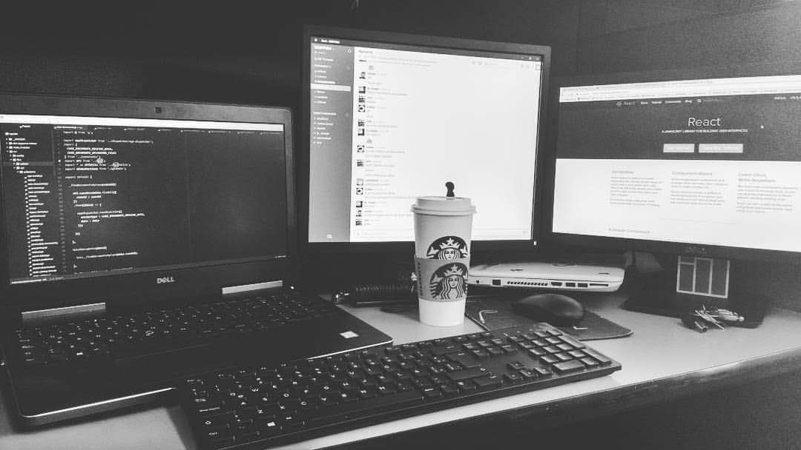

Codea es un proyecto que nace para poder compartir libremente experiencias con desarrollo de software, desde cómo solucionaste un problema hasta crear artículos de cualquier lenguaje totalmente en español, si eres un desarrollador o UX etc. Y te gusta compartir lo que haces o ayudar a los demás bienvenid@ codea quiere que la comunidad crezca con gente como tú.

## ¿Por qué ayudar a la comunidad?

Soy un desarrollador que le apasiona mucho crear cosas para la web, todo eso me ha llevado a presentarme con problemas en el desarrollo por experimentar con librerías, Framenworks, software, etc. De verdad doy gracias a todas esas comunidades que hacen un gran esfuerzo para hacer nuestra vida de desarrollador más fácil, ya sea que estamos aprendiendo a programar, aprendiendo un nuevo lenguaje o cuando tenemos un error que no sabemos solucionar, todos somos la comunidad desde aportar con una respuesta en sitios como stackoverflow, un blog, etc.

> Por más pequeña que sientas que es tu aportación no importan por algo se empieza o no. :stuck_out_tongue_winking_eye:

En el próximo articulo escribiré sobre los pasos para poder aportar en codea :sunglasses:.

> Gracias por darte unos minutos de leer este pequeño articulo donde saludo a la futura comunidad de codea.
> Para serte honesto es mi primer artículo, pero con gran pasión me tomaré el tiempo que sea para poder mejorarlo.
