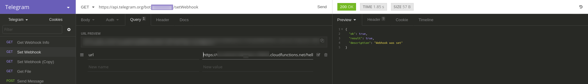
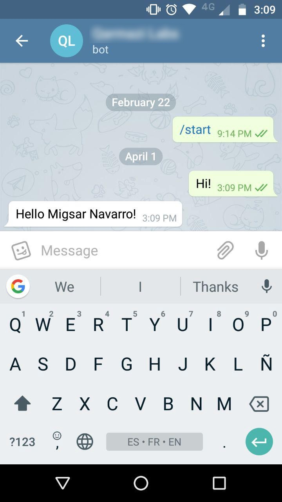

El objetivo de este post es servir de guía práctica para crear un bot de Telegram bastante sencillo. Ya existen otros documentos, pero me pareció que no eran tan sencillos de seguir como me gustaría que fuera éste. A continuación enlisto los links necesarios para trabajar con el API de Telegram Bot, no es necesario revisarlo por ahora, pero creo que ubicados al inicio funcionan mucho mejor para referencia futura:

- [Página de desarrolladores de Telegram Bot](https://core.telegram.org/bots/)
- [API de Telegram Bot](https://core.telegram.org/bots/api)
- [Ejemplos de Telegram Bots](https://core.telegram.org/bots/samples)

> Para echar a andar un bot necesitamos trabajar al mismo tiempo en dos flujos separados:

1. Un servidor web que procesa el mensaje del bot y genera una salida.
2. La configuración e integración del bot con Telegram.

Es importante hacer esta separación cuanto antes porque, si se hace correctamente, nos permitirá, en un futuro, utilizar nuestro código del bot en varias plataformas diferentes sin cambios fuertes, es decir, podríamos mantener el comportamiento y gran parte de nuestro código para plataformas como [Slack](https://api.slack.com/), [GitHub](https://developer.github.com/webhooks/) o [Facebook](https://developers.facebook.com/docs/messenger-platform/introduction), por ejemplo.

```

```

### Conceptos básicos

#### ¿Qué es Telegram?

Estoy casi seguro de que si estás aquí es porque ya lo sabes, pero aquí vamos… Telegram es una plataforma de mensajería en línea y de código abierto, muy similar a Whatsapp aparentemente pero con algunas diferencias al revisar más a fondo. La que me parece más importante es que puedes usar muchos dispositivos al mismo tiempo, usando el celular como identificación de dos pasos, pero por lo demás con sesiones completamente independientes, por lo que no importa si a tu teléfono se le acaba la batería o simplemente lo quieres desconectar de internet un rato mientras estás en tu casa o trabajo. También es posible usarlo para transferir archivos entre dispositivos y como es una plataforma, y no una simple aplicación, es posible hacer otras cuantas cosas que, a mi parecer, han sido bastante desaprovechadas, las plataformas te permiten construir alrededor de ellas, utilizándolas, las aplicaciones, aún si tienen un API público sólo permiten usarlas e integrarlas, no expandirlas. Telegram tiene una gran variedad de servicios, entre los que se encuentran juegos, sistema de pagos, video y canales, sin embargo, todo tiene un costo y hablaremos de eso mientras construyamos nuestro bot.

#### ¿Qué es un bot?

Puesto de un modo sencillo, un bot es un montón de código que toma la entrada de un usuario y produce una respuesta automática en base a ella, es decir, procesándola. No es tan diferente del clásico modelo de servidor, en el que también existe cierto procesamiento para enviar una respuesta a la petición que se recibe, el cambio principal es el enfoque, los bots se espera que sean activados por interacción directa con el usuario, sea escrita o hablada y la respuesta del servidor es activada por eventos HTTP que son emitidos por el navegador debido a la interacción con el usuario. Un concepto muy comunmente mencionado cuando se habla de bots es el de [Procesamiento de Lenguaje Natural](https://es.wikipedia.org/wiki/Procesamiento_de_lenguajes_naturales), que significa entender el lenguaje de los seres humanos como es usado por nosotros, con todo y contexto. Los bots más famosos son capaces de conversar, pero no es un requisito indispensable para un bot.

#### ¿Qué es una función serverless?

Está es mi definición, para una mucho más completa es mejor ver este artículo de Mike Robert sobre las [Arquitecturas Serverless](https://martinfowler.com/articles/serverless.html). Una función serverless, es una función que se ejecuta generalmente en un servidor HTTP pero cuya infraestructura está totalmente administrada por una PaaS (Plataforma como Servicio), por lo que uno como programador sólo sube la función y da por hecho que el ambiente y la conectividad ya funcionan perfectamente, sólo se recibirá una entrada con un formato bonito con el que nuestra función producirá una respuesta igual de bonita, ambas, la entrada y la respuesta, ya existen en el contexto de ejecución de la función. El término serverless (sin servidor) hace alusión al hecho de que sólo nos concentramos en la función, por lo que podemos usarla en cualquier servidor, es decir, no está acoplada con uno en particular, no al hecho de que no exista servidor.

#### ¿Por qué utilizar una función serverless?

La parte increíble de las funciones serverless es el hecho de no tener que preocuparse (tanto) de la infraestructura, de la carga y el escalamiento que implica o de cualquier otra cosa que no sea la programación misma. El desarrollo se puede visualizar como una caja negra con la que se conecta nuestra función. He visto algunos artículos que mencionan que el precio es un criterio importante para la elección y otros hablan de los costos ocultos, creo que no es tan fácil hacer una declaración al respecto y mucho menos generalizarla a cualquier proyecto, además está totalmente fuera del alcance de este artículo. Sin embargo, un bot para uso personal, que permita controlar las luces de una casa o enviar el post de un usuario a un sitio estático desde Telegram, requiere muy pocos requests al mes y en la mayoría de los proveedores estará dentro de un paquete gratuito. Escogí esta arquitectura para el artículo porque me parece que permite un desarrollo sencillo y bastante enfocado a la funcionalidad del bot y no a otros detalles técnicos, por lo que es fácil que alguien sin una formación técnica pero con ganas de hacer un bot pueda echarlo a andar.

```

```

### La parte del servidor

Esta vez utilizaremos Google Cloud Platform, no por que haya un motivo en particular, de hecho, AWS, Azure y otros proveedores de funciones serverless son todos muy similares y tienen una documentación muy completa. Es por eso mismo que no lo pensé tanto y usé esta [guía](https://cloud.google.com/functions/docs/quickstart) como punto de partida, los pasos, sin entrar en detalles, son:

1. Abrir una cuenta de Google Cloud y habilitar el método de pago, la idea no es utilizarlo, si no se había usado antes a veces se hace un cargo de un dólar, pero lo demás debe quedar dentro del uso gratuito, aunque depende mucho del caso particular, por lo que si tienes duda revísalo (es buena práctica cuando se está aprendiendo borrar todas las instancias al terminar el ejemplo y guardar el código desarrollado en un repositorio).
2. Descargar e instalar gcloud para la línea de comandos.
3. Habilititar el API de Functions.
4. Crear tu primera función.

```

```

### La parte de Telegram

Esta es la parte fuerte del artículo y empezaré hablando un poco sobre Telegram. La plataforma es centralizada, no es algo que me guste mucho pero creo que en este caso es una buena medida en términos de política de privacidad y la forma más sencilla de hacer rápidamente una plataforma de mensajería de código abierto. La privacidad es muy importante en los servicios web, es un tema que se menciona comunmente en los medios de comunicación y afecta las decisiones financieras relacionadas con este tipo de proyectos, esto es aún más cierto para un servicio de mensajería en el que millones de usuarios llevan a cabo conversaciones íntimas y transmiten muchos datos privados, aún después de encriptar todo existen demasiados componentes y cada uno de ellos es una puerta de entrada a la plataforma, por lo mismo, una forma de proteger la plataforma (no diré que no haya una ventaja competitiva en todo esto) es poner un punto de acceso (proxy, gateway o lo que quieran llamar, por ahora no importa) entre los usuarios y la infraestructura, no se trata de censurar sino de hacer que la superficie para un ataque sea la mínima. Al poner un servidor intermedio los usuarios no se dirigen uno al otro y en lugar de tener que enviar la información de contacto de cada usuario se puede solo tener la información de la red de Telegram y las relaciones entre usuarios. Si estás pensando que el atacar ese servidor puede inhabilitar el sistema, estás en lo cierto, el punto de falla es ese servidor, aunque es más fácil concentrar los esfuerzos en él y uno lo puede ver como una ventaja porque no tiene que preocuparse tanto del manejo de datos privados del usuario, se puede diseñar un bot de tal modo que lo único que se tenga es el id del usuario (también se puede pedir la información si eso se desea) y hace mucho más fácil el desarrollo en etapas tempranas.

Una vez aclarado este punto, podemos empezar con el desarrollo, entendiendo que todos los mensajes que nuestro bot procese vendrán de Telegram e irán a Telegram, no a los usuarios. Ahora vamos a retomar el proyecto a partir de la guía de inicio de Google Cloud Functions, para este momento deberías de tener un servidor corriendo que responda con un mensaje genérico cualquier petición que reciba. Si es así, podemos llevar a cabo los siguientes pasos:

#### 1. Registrar el bot con BotFather.

Sí, [BotFather](https://telegram.me/botfather) es un bot, que sirve para registrar los nuevos bots en la plataforma. Si lees esto en tu celular o computadora con Telegram puedes darle click al link e iniciar directamente el chat con BotFather, si no, tendrás que buscar BotFather en Telegram para iniciar un chat con él, sigue sus indicaciones para registrar un bot y obtener un token, que utilizaremos para legitimar nuestra comunicación con el servidor de Telegram.


#### 2. Registrar un webhook en Telegram para obtener los nuevos mensajes.

Existen dos métodos para obtener los nuevos mensajes del bot: Polling y Webhook. Resumiendo un poco, polling significa preguntarle al servidor de Telegram cada cierto tiempo si tiene nuevos mensajes (poll se refiere a encuestar o votar en inglés), esto implica definir el intervalo y escribir el código (llamada asíncrona) que haga el polling; webhook es el enfoque contrario, se registra una dirección en el servidor de Telegram y cada vez que llegue un mensaje el servidor se comunicará con nosotros a la dirección que registramos, en este caso Telegram se encarga de hacer la petición a nuestra dirección y, por ahora, nos simplifica el trabajo, así que es la que usaremos. Es importante notar que las decisiones que tomemos ahora son para un bot de prueba, en uno real varios factores técnicos entran en juego, es posible que se necesite una cola a la que lleguen los mensajes para desacoplar los distintos componentes, varias instancias de servidor y tener balanceo de cargas, etcétera (aún utilizando serverless es probable que uno desee algo de control sobre estos detalles, por un lado está el detalle del costo y por otro la parte de analytics, ambos fuera del alcance del post), por ahora, nos quedamos con polling.

```

```



Para este paso podemos usar curl, Postman, [Insomnia](https://insomnia.rest/) o incluso usar el navegador para hacer un request a ‘/setWebhook’ usando nuestro token y enviando el url a registrar. Es posible hacer request GET o POST y enviar el url como parámetro en el query, es buena idea añadir un token, inventado por nosotros al url que registremos, este token debe de ser mantenido en secreto y hablaremos un poco sobre él en la próxima sección, el url a registrar debe de quedar parecido a ‘https://us-central1-my-bot.cloudfunctions.net/helloBot/-mi-token-secreto' or this ‘https://us-central1-my-bot.cloudfunctions.net/helloBot?token=mi-token-secreto'.

#### 3. Crear una función que envíe un mensaje de respuesta al usuario.

En este tutorial sólo saludaremos al usuario del bot, aquí dejo el [repositorio en GitHub](https://github.com/migh/hellobot), aún así recomiendo seguirlo y no copiar y pegar para tener claros los pasos. En primer lugar enviamos una petición POST al endpoint ‘/sendMessage’, en los documentos de Telegram se menciona que las peticiones pueden ser GET o POST. El mensaje que recibiremos está definido en la sección [Available Types -> Message](https://core.telegram.org/bots/api#message) del API de Telegram, podemos ver que existe una propiedad llamada from que es de tipo User , y que dentro de ésta tenemos nombre y apellido, las usaremos para enviar un saludo personalizado. También existe una propiedad llamada chat de tipo Chat que tiene un id que vamos a ocupar para enviar los mensajes al mismo chat desde el que el usuario los está enviando.

Para hacer la petición de envío de mensaje vamos a usar [axios](https://github.com/axios/axios), existen muchas alternativas, incluyendo el utilizar el módulo http de node sin necesidad de bibliotecas. Ahora retomaremos la parte de la seguridad, haciendo un par de aclaraciones al respecto, la primera es que las funciones serverless están en línea y expuestas a todos los usuarios que envíen peticiones a su dirección, lo que implica que puede ser iniciada sin autorización por cualquiera, con el costo asociado y, también, que cualquiera puede enviar mensajes a nuestros usuarios, no es tan fácil, en el sentido que debe de tener un chat válido y el formato correcto, pero tampoco es tan difícil. Es por esto que la documentación de Telegram sugiere agregar el token que agregarmos en el paso anterior, es una medida de seguridad adicional para evitar el envío de mensajes indeseados, en Google Functions los objetos req y res tienen la misma estructura que los de [Express](https://expressjs.com/), podemos obtener el secreto que registramos en la sección anterior de varias maneras dependiendo de preferencias personales y del modo utilizado en el registro:

- El url base es: https://us-central1-my-bot.cloudfunctions.net/helloBot. Vale la pena notar que la última parte es el nombre de tu función.

- En req.path aparece el resto de la ruta utilizada, /mi-token-secreto.

- El objeto req.params contiene un arreglo asociativo en el que se puede acceseder la parte correspondiente en base a su posición en el url, sin embargo, depende de la configuración de la ruta y no tenemos control de eso aquí, por lo que todo aparece en la posición cero, req.params[0], tiene el mismo valor que path /mi-token-secreto.

- También podemos usar req.query, regresa la parte del query, que es la que aparece después del símbolo de interrogación ?. Para este ejemplo, si en la sección anterior usaste la última forma, req.query.token = /mi-token-secreto.

La segunda consideración es sobre el token que obtenemos de BotFather, es muy importante cuidarlo porque es nuestra llave de acceso al API de Telegram, recordemos que además de permitir enviar mensajes se utiliza para registrar el webhook, por lo que si alguien lo obtiene puede sencillamente borrar nuestro webhook y poner el suyo, y todo el tráfico de nuestro bot le llegará a él. Existen varias formas de mantener el token seguro, creo que para un proyecto que se piensa sacar al mercado vale la pena revisarlas a detalle, una de las primeras sería, si usamos Google Cloud seguir esta [guía](https://cloud.google.com/functions/docs/writing/http) o buscar la que exista para nuestro proveedor (AWS tiene la parte de manejo de identidad y autenticación muy completa y Azure también ofrece servicios similares), en el contexto de la nube y microservicios se conocen como secrets a los servicios usados para guardar, distribuir y acceder contenido que necesita estar seguro, como tokens, credenciales y certificados, lo principal es que éstas nunca sean parte del código y el repositorio. Para nuestro ejercicio, Google Functions usa un archivo differente para ignorar los archivos que no tomará en cuenta, .gcloudignore, así que podemos usar un archivo local.js con nuestro password y agregarlo al archivo .ignore que utiliza git.

```javascript
  const http = require('http');
  const axios = require('axios');
  const localconf = require('./local.js');

  exports.helloBot = (req, res) => {
    function sendMessage(options) {
      const token = localconf.telegramToken;
      const url = 'https://api.telegram.org/bot${token}/sendMessage';

      axios.post(url, {
        chat_id: options.chatId,
        text: options.greetings
      })
      .then(function (response) {
        console.log(response);
        res.send({ status: ‘OK’});
      })
      .catch(function (error) {
        console.log(error);
        res.sendStatus(500);
      });
    }

    const callToken = req.path;

    if ( callToken !== localconf.webhookToken ) {
        const message = req.body.message;

        const options = {
          greetings: `Hello ${message.from.first_name} ${message.from.last_name}!`,
          chatId: message.chat.id
        };

        sendMessage(options);
      } else {
        res.sendStatus(403);
      }
  };
```

```

```

### Conclusiones



Espero que hayas disfrutado el tutorial y que ahora tengas una idea más clara de lo que se requiere para un bot sencillo, estaré atento a los comentarios para pensar en una segunda parte, si es solicitada, y decidir el tema un poco más específico. Dejo un par de ideas para probar con un bot:

- Empezar a crear un bot capaz de conversar (Lo más sencillo es usar un API de un servicio de Procesamiento de Languaje Natural).

- Publicar posts en un sitio estático (con Jekyll o Gatsby) directamente desde Telegram.

- Controlar un proyecto de IoT (Internet de las cosas) desde Telegram.

- Hacer una integración con un API como YouTube or Spotify.

- Monitorear algo desde Telegram, como criptodivisas o el estado de los servidores.

- Un chat de asistencia para un negocio, totalmente en vivo y desde el teléfono (asumiendo que tenga Telegram instalado), pero sin la necesidad de dar el número telefónico.
